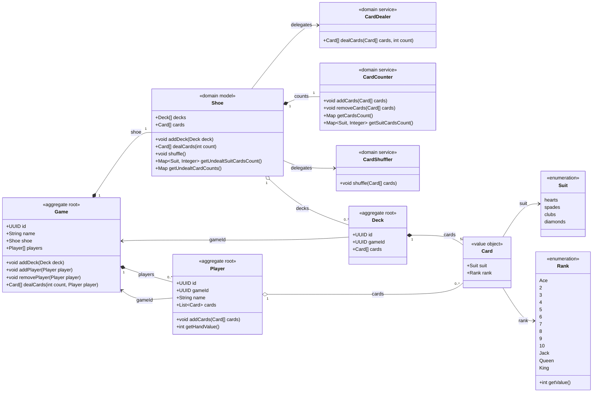

# Domain UML



## Aggregate roots

The aggregate roots are `Game`, `Player`, and `Deck`.

Game owns players and one Shoe. Shoe owns the attached decks and ordered undealt
card occurrences, delegating to CardDealer, CardCounter, and CardShuffler. It has
no separate identity, factory, repository, or persistence entity. GameEntity
persists the decks relationship and undealt list directly; its mapper restores
Shoe from that state. Deck.gameId records attachment to the game.

## Domain Notes

- `Game.dealCards(cardCount, player)` transfers the next available cards
  from its shoe to the supplied player without changing membership.
- `Deck` references its owning game directly through `gameId`.
- A newly created deck may have a null `gameId` until it is added to a game.
- `Card` is an immutable value object containing only `suit` and `rank`, with no identity or deck reference.
- Cards with the same suit/rank compare as equal values. Ordered card lists retain separate occurrences, including duplicate faces from multiple decks.
- Card values are stored as ordered JSON arrays in deck and player rows, and
  the game row stores its ordered undealt cards; there is no Card table.
- Shoe tracks undealt cards independently of the original deck cards. Adding a
  deck appends its cards; dealing removes the next available occurrences.
  Removing players never returns dealt cards to the undealt list.
- `Player` references its game through `gameId`.
- `Shoe` owns the domain behavior related to undealt cards: adding decks, shuffling, dealing, and remaining-card counts.
- `Card` does not store a numeric value; the value is derived from `Rank`.
- `Rank.getValue()` maps Ace to 1 through King to 13.
- `Player` directly owns an ordered `List<Card> cards`, initially empty.
- `Player.addCards(...)` adds dealt cards to that list.
- `Player.getHandValue()` derives the total from the ranks of its cards; no separate `Hand` class is needed.
- Request/response DTOs are intentionally excluded.

## Shoe storage, counting, and shuffling

Implemented: Shoe keeps card order in an ArrayList, delegates removal from the end to CardDealer when
dealing, and delegates suit/rank counting to CardCounter. Shoe delegates shuffle to the
Spring-independent domain service CardShuffler, supplied through its constructor.
Shoe provides default collaborators and a full constructor for supplying mocks.
CardShuffler.shuffle(cards) uses a default library RNG; its
RandomGenerator overload accepts a controllable generator for testing.
Shoe exposes shuffle() and passes its backing list.
CardCounter is a stateful domain helper owned by one shoe; never share it between
shoes or register it as a singleton. Shoe's default constructors create a fresh counter; tests can inject a mock.
Shoe delegates addCards, removeCards, getCardsCount, and getSuitCardsCount to it.
Suit counts are returned as an immutable Map<Suit, Integer> snapshot containing
every suit, including zero counts; response mappers own the DTO representation.

Shoe stores attached decks and the undealt list; CardCounter stores the nested map:

```java
List<Card> cards; // backed by ArrayList; last entry is next to deal
EnumMap<Suit, EnumMap<Rank, Integer>> remainingCounts;
```

The list contains only undealt occurrences. Dealing removes its last entry,
so consumed cards are excluded from counting, shuffling, and persistence.
Adding a deck appends its cards, making the added cards next to deal. Equal suit/rank values remain separate list entries, so cards
from multiple decks are preserved.

The nested count map indexes faces rather than individual physical cards.
Create suit/rank entries as cards are counted; missing entries read as zero. A suit/deck composite key
would group 13 cards and would need additional rank entries; deck identity and
per-card positions are unnecessary for the required remaining-card counts.

| Operation | Behavior | In-memory cost |
| --- | --- | --- |
| Add a deck | Append its cards and increment face counters | O(cards added), amortized |
| Deal k cards | Remove the last entries and decrement their face counters | O(cards actually dealt) |
| Count a face | Read its suit/rank counter | O(1) |
| Count suits | Sum the 13 rank counters for each suit | O(1), with four suits and 13 ranks fixed |
| Shuffle | Permute the complete undealt list across all attached decks | O(undealt cards) |

Removing from the end avoids shifting remaining entries and releases consumed
card references without retaining a prefix or maintaining a cursor.
All mutations must go through Shoe methods so counters and order stay consistent.
Counters never change during shuffle because only positions change.
EnumMap supports enum-keyed lookup with constant-time basic operations;
see the [Java EnumMap documentation](https://docs.oracle.com/en/java/javase/26/docs/api/java.base/java/util/EnumMap.html).

### Fisher–Yates shuffle

CardShuffler implements the modern in-place Fisher–Yates algorithm. It uses one bounded random choice
and one swap per iteration, takes linear time, and needs constant auxiliary space.
With uniform bounded random choices, every permutation of card occurrences is
equally likely. It satisfies the requirement to implement shuffle ourselves:
only the random-number generator comes from the library; no library-provided
shuffle operation is called. See the [NIST Fisher–Yates reference](https://xlinux.nist.gov/dads/HTML/fisherYatesShuffle.html).

Starting at the last list index, walk backward while i > 0.
Choose j uniformly from 0 through i, inclusive, and swap entries i
and j. Shuffle returns void. For zero or one remaining card, do nothing.
Permute all remaining cards together, rather than shuffling each deck separately.
Exclude consumed cards; player hands and discarded cards remain unavailable.

Assigning independent random priorities and sorting would require O(n log n)
sorting and handling priority collisions. Randomly assigning positions also
requires resolving collisions. Fisher–Yates guarantees unique occupied positions
through swaps and avoids both complications.

### Persistence and verification

Persist the complete undealt list in the existing game-row card array.
Restore the list in its saved order and rebuild the count map once in O(n).
Do not persist redundant counters or rebuild undealt cards from original decks.
Loading and saving the card array still cost O(n); the table describes only
in-memory shoe operations.

Test permutation preservation, duplicate occurrences, unchanged face/suit counts,
empty and single-card undealt lists, bounded random choices with a controllable generator,
and exclusion of dealt/discarded cards. Verify that shuffle, subsequent deals,
deck additions, and reloading preserve order and counts. A shuffle may legitimately
leave the order unchanged, so tests must not require every shuffle to change it.

CardCounter.getCardsCount() returns an immutable nested Map<Suit, Map<Rank, Integer>>
snapshot with all 52 face counts, including zeros. Iteration follows hearts,
spades, clubs, diamonds, with ranks descending by value from King (13) to Ace (1).
LinkedHashMap preserves both orders; Map.copyOf does not guarantee iteration
order. Shoe.getUndealtCardCounts() exposes this snapshot to response mappers.

CardDealer.dealCards(cards, cardCount) removes up to the requested number from
the end of the mutable undealt list and returns an immutable hand. Shoe then
updates its CardCounter with that hand. CardDealer is stateless and independent
of counting and is supplied to Shoe.

Game creates an empty Shoe or accepts restored Shoe and player state. Its mapper
only maps persistent values and does not configure card services. Shoe has three
constructors: empty state, restoration from decks and undealt cards, and full
collaborator injection. Defaults create a fresh per-shoe counter and instance
dealer/shuffler. GameTest mocks Shoe; ShoeTest mocks the three card collaborators.
Domain services have no Spring bean wiring or annotations.
