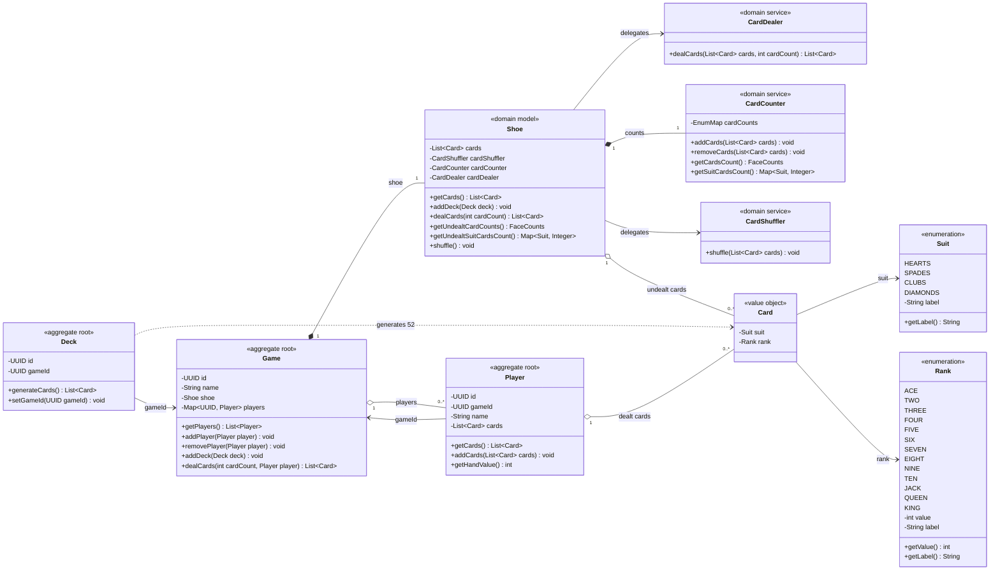

# Domain UML

## Domain Notes

`Shoe` stores the game's state. It three domain services: `CardDealer` removes cards,
`CardCounter` tracks suit/rank counts, and `CardShuffler` changes card order.
This separates responsibilities and makes each behavior independently testable.

## Shuffle

`CardShuffler` uses in-place Fisher–Yates: walk backward from the last card,
choose a random index from zero through the current index, and swap those cards.
All undealt cards are shuffled together; hands and counts stay unchanged.
Uniform random choices make every permutation equally likely. The algorithm
takes O(n) time and O(1) extra space.
