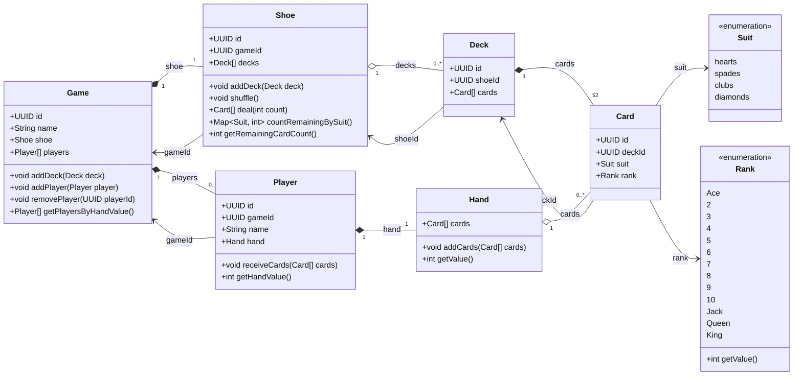

# Domain UML

## Domain Notes

- `Game` owns exactly one `Shoe`.
- `Shoe` has its own `id` and references its owning game through `gameId`.
- `Deck` references the shoe it belongs to through `shoeId`.
- `Deck.gameId` is intentionally omitted because the game can be derived through `Deck.shoeId -> Shoe.gameId`; storing both would duplicate the relationship.
- A newly created deck may have a null `shoeId` until it is added to a game's shoe.
- `Card` has its own `id` and references its original deck through `deckId`.
- `Player` references its game through `gameId`.
- `Shoe` owns the domain behavior related to undealt cards: adding decks, shuffling, dealing, and remaining-card counts.
- `Card` does not store a numeric value; the value is derived from `Rank`.
- `Rank.getValue()` maps Ace to 1 through King to 13.
- `Player` owns one `Hand`.
- `Hand` aggregates dealt cards and owns hand-specific rules and calculations.
- Request/response DTOs are intentionally excluded.
