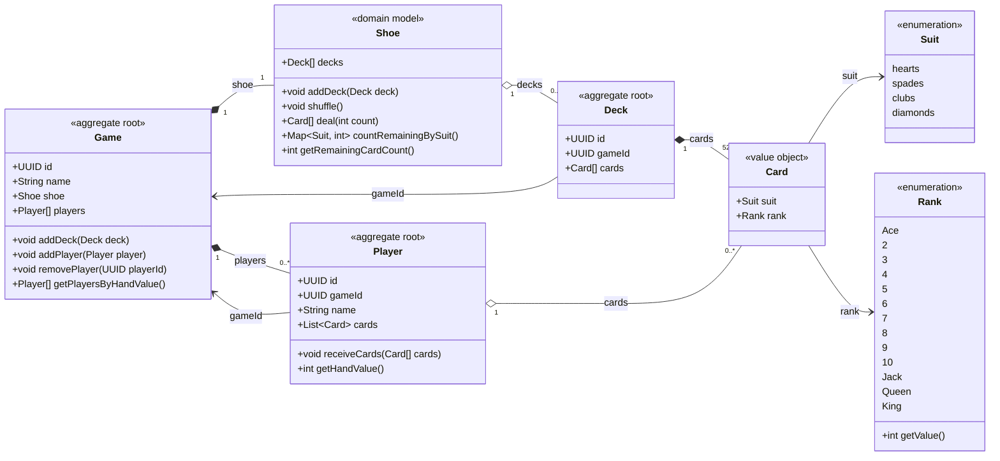

# Domain UML

## Aggregate roots

The aggregate roots are `Game`, `Player`, and `Deck`.

`Shoe` is a domain model owned by Game, not an aggregate root. It keeps the
shoe's rules and behavior in one place and is initialized by the Game constructor.
It has no separate factory, persistence entity, table, or repository.
GameEntity stores an ordered collection of DeckEntity values through its
`decks` relationship. Shoe has no ID or game ID. Mappers restore it from the game
entity's deck collection; Deck.gameId records attachment directly.

## Domain Notes

- `Game` owns exactly one `Shoe`.
- `Shoe` has no `id` or `gameId`; it is a behavior-bearing collection owned by Game.
- `Deck` references its owning game directly through `gameId`.
- A newly created deck may have a null `gameId` until it is added to a game's shoe.
- `Card` is an immutable value object containing only `suit` and `rank`, with no identity or deck reference.
- Cards with the same suit/rank compare as equal values. Ordered card lists retain separate occurrences, including duplicate faces from multiple decks.
- Card values are stored as ordered JSON arrays in the owning deck and player rows; there is no Card table.
- `Player` references its game through `gameId`.
- `Shoe` owns the domain behavior related to undealt cards: adding decks, shuffling, dealing, and remaining-card counts.
- `Card` does not store a numeric value; the value is derived from `Rank`.
- `Rank.getValue()` maps Ace to 1 through King to 13.
- `Player` directly owns an ordered `List<Card> cards`, initially empty.
- `Player.receiveCards(...)` adds dealt cards to that list.
- `Player.getHandValue()` derives the total from the ranks of its cards; no separate `Hand` class is needed.
- Request/response DTOs are intentionally excluded.
